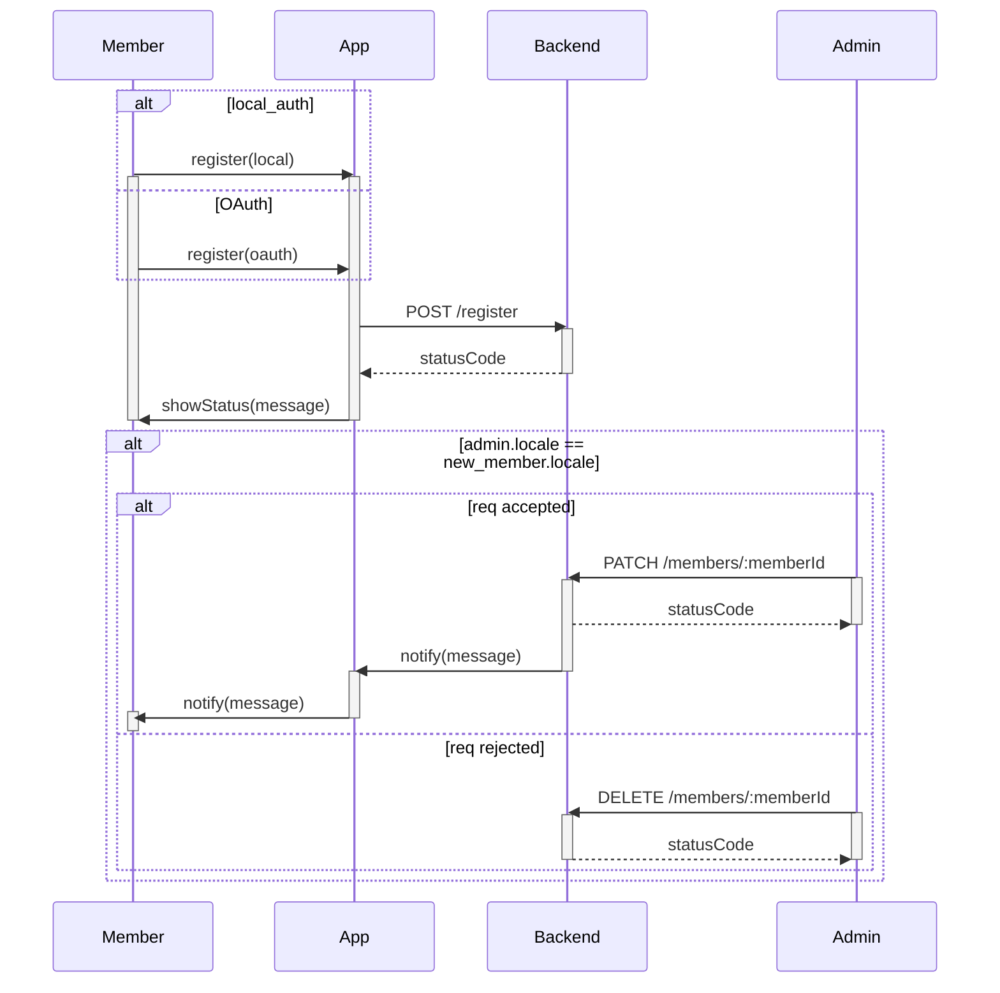

```mermaid
sequenceDiagram
    participant member as Member
    participant app as App
    participant backend as Backend
    participant admin as Admin
    
    alt local_auth
        member ->> app: register(local)
        activate member
        activate app
    else OAuth
        member ->> app: register(oauth)
    end

    app ->> backend: POST /register
    activate backend
    backend -->>app: statusCode
    
    deactivate backend

    app ->> member: showStatus(message)

    deactivate member
    deactivate app

    alt admin.locale == new_member.locale
        alt req accepted
            admin ->> backend: PATCH /members/:memberId

            activate admin
            activate backend

            backend -->> admin: statusCode

            deactivate admin

            backend ->> app: notify(message)

            deactivate backend
            activate app

            app ->> member: notify(message)

            activate member
            deactivate member

            deactivate app
        else req rejected
            admin ->> backend: DELETE /members/:memberId

            activate admin
            activate backend

            backend -->> admin: statusCode

            deactivate admin
            deactivate backend
        end
    end
```